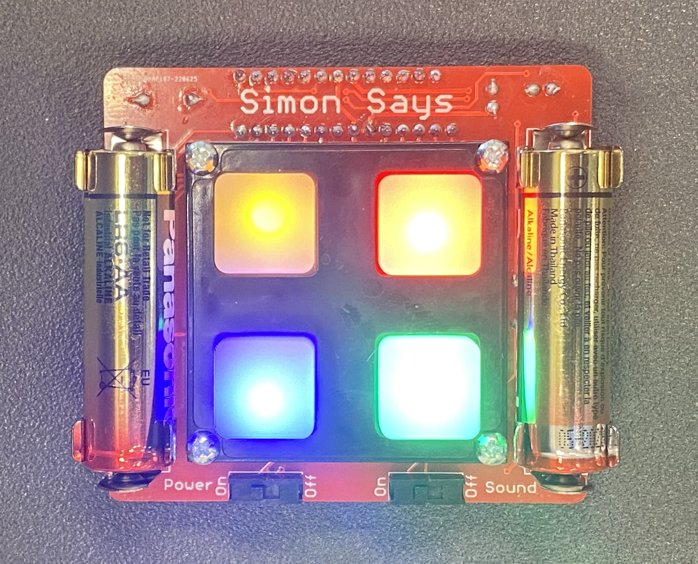
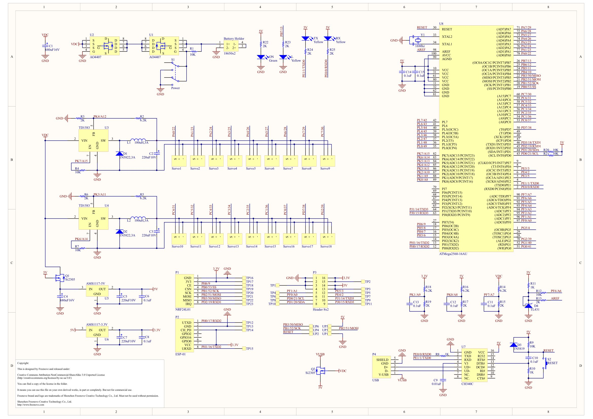
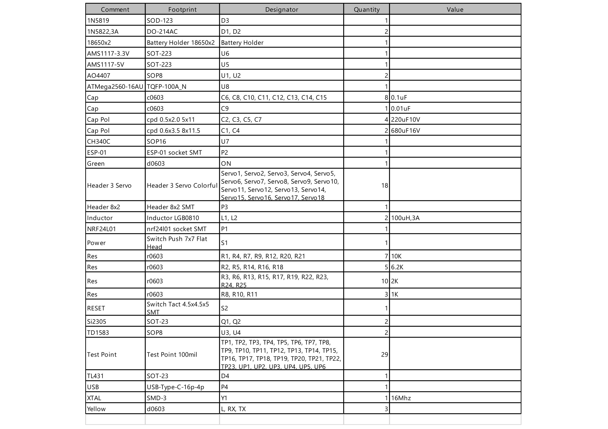

# Hexapod
A hexapod robot is a robot that walks on six legs, which allows it to have greater flexibility in its movement, like being able to walk on uneven terrain.

| **Engineer** | **School** | **Area of Interest** | **Grade** |
|:--:|:--:|:--:|:--:|
| Arnav M | Monta Vista High School | Mechanical Engineering | Incoming Senior

<!--<>
  
# Final Milestone
For your final milestone, explain the outcome of your project. Key details to include are:
- What you've accomplished since your previous milestone
- What your biggest challenges and triumphs were at BSE
- A summary of key topics you learned about
- What you hope to learn in the future after everything you've learned at BSE

**Don't forget to replace the text below with the embedding for your milestone video. Go to Youtube, click Share -> Embed, and copy and paste the code to replace what's below.**

<iframe width="560" height="315" src="https://www.youtube.com/embed/F7M7imOVGug" title="YouTube video player" frameborder="0" allow="accelerometer; autoplay; clipboard-write; encrypted-media; gyroscope; picture-in-picture; web-share" allowfullscreen></iframe>
-->
# Second Milestone
For my second milestone, the first thing I did was attach the other baseplate to the other side of the robot so that the circuit board is protected from any harm, and so the robot looks better. 

The next thing I did was calibrate the robot. I did this by using the calibration tab in the Processing app. Using the calibration sheet provided, I had to move each leg in three dimensions so that the robot lined up with the diagram on the calibration sheet. 

Then, I moved on to controlling the robot through Wi-Fi using the WLAN module. However, I mistook the remote control module for the WLAN module, which caused the circuit board to heat up, so I immediately turned off the power and removed the battery. However, I didn't realize that this caused the calibration to reset. From that, I learned that I have to leave the battery connected at all times, otherwise, the calibration will reset. I recalibrated the robot, using the calibration sheet again. 

After I finished calibrating the robot again, I attached the correct WLAN module to its correct port on the circuit board. This created a hotspot, which I connected my laptop to. From then on, I was able to control the robot through the control tab on the Processing app.

One issue I faced at the end was the robot momentarily disconnecting from its hotspot. This is just because the hotspot is not as reliable as the Wi-Fi, but is irrelevant, as the robot connects back to the hotspot by itself. 

So far, building the hexapod has been the most challenging part of this project. Reaching my first milestone took me close to a week, but to reach my second milestone, it only took me one day. Overall, this project is much heavier on the mechanical engineering side, rather than the electrical engineering or computer science side.

My next step is going to be controlling the robot through the remote controller and through my phone using the Freenove app. After that, my first modification is to build a container to hold the battery, so that it is not sitting loose on top of the robot. 

# First Milestone
My intensive project is a hexapod, a robot that has 6 legs and can walk on any terrain. In order to build it, I have to first build the individual parts of the hexapod, attach the legs, complete the wiring, and then lastly calibrate the robot. The individual parts of the hexapod include the base, the circuit board, the legs, and the battery. First, the circuit board is attached to the base, and the battery is connected to the circuit board. Lastly, each leg is attached to the base of the robot while the power is on so that the robot is calibrated properly. Each leg is made up of 3 servo motors, and 4 different acrylic parts, which I attached together using screws and disc servo arms.

To set up the software, I had to install the Arduino and Processing IDEs. In the Arduino IDE, I had to install the FNHR, RF24, and FlexiTimer2 libraries. In the Processing IDE, I had to install the ControlP5 library. Then, in the Processing IDE, I had to open the Processing App, which opened the hexapod software, from which I can control, install, and calibrate the hexapod.

So far, I have built the base and attached all of the legs to the base, while ensuring that the legs are positioned correctly when the power is on. 

One issue that came up was that I attached all of the legs when the battery was disconnected, which caused the legs to be positioned incorrectly. Therefore, I had to disassemble the robot, connect the battery, turn on the power, and reinstall the legs.

Another issue that came up was one of my battery contacts coming loose after I fully assembled my robot. I had to replace the circuit board, and basically, I had to rebuild the robot again from scratch.

The last issue that I faced was having broken servo motors, since the only way to check that, would be after it was assembled. If I found out that a motor was broken, I had to disassemble the leg, replace the servo motor, and reattach the leg. I had one motor that was spazzing out, one with a screw stuck in the outer shaft, and two with disconnected wires, so I had to replace all 4 of them.

My next steps are to calibrate the robot so that its default position is how I want it, then I should be able to control the robot as I want, using my laptop. Then, I need to connect the remote control and install the app on my phone, so that I can control the hexapod with the remote or with my phone.

# Starter Project
<iframe width="560" height="315" src="https://www.youtube.com/embed/Bm8i1o8ru9k" title="YouTube video player" frameborder="0" allow="accelerometer; autoplay; clipboard-write; encrypted-media; gyroscope; picture-in-picture; web-share" allowfullscreen></iframe>

My starter project was building a Simon Says Machine. To build the machine, I had to solder the LEDs, power and sound switches, battery clips, decoupling caps, a microcontroller, and an alarm. 

My main difficulty was manipulating the solder so that the shape of it looks clean and appealing. I fixed this by applying the solder first, and if I was unhappy with the shape, I manipulated the solder using the soldering iron to remelt and reshape the solder. 

The machine works by emitting a series of colors and sounds, and the user's job is to copy exactly what the machine does like the game, Simon Says. Each of the four buttons has a unique color and sound to make it easier for the user and also more accessible for everyone. The game will keep adding onto the pattern until the user messes up the pattern, at which point, the machine will make a loud beeping sound and all four of the lights will go off.

The Simon Says Machine can be found here: https://www.sparkfun.com/products/10547



# Schematics 



# Code
Here's where you'll put your code. The syntax below places it into a block of code. Follow the guide [here]([url](https://www.markdownguide.org/extended-syntax/)) to learn how to customize it to your project needs. 

```c++
// control robot
ControlRobot controlRobot = new ControlRobot(this);
// gui
import controlP5.*;
ControlP5 cp5;
PFont font;
Textlabel textlabelInfo;
Textlabel textlabelVoltage;
Slider2D slider2dMove;
Slider2D slider2dRotate;
// images for gui
PImage pImageControl;
PImage pImageTwistBody;
PImage pImageCalibration;
PImage pImageInstallation;
// constants for gui
final color backgroundColor = color(128);
final color globalTabColor = color(102);
final int globalTapHeight = 100;
final int tabWidth = 128;
final int tabHeight = 24;
// event
int eventId = 0;
boolean isProcessEvent = false;
// voltage
int lastGetVoltage = 0;

void setup() {
  size(800, 600);
  noStroke();
  font = createFont("Lucida Sans Regular", 16);
  textFont(font);
  textAlign(CENTER, CENTER);
  pImageControl = loadImage("control.png");
  pImageTwistBody = loadImage("twistBody.png");
  pImageCalibration = loadImage("calibration.png");
  pImageInstallation = loadImage("installation.png");

  setControlP5();
}

void draw() {
  background(backgroundColor);
  fill(globalTabColor);
  rect(0, tabHeight, width, globalTapHeight);
  rect(0, height - tabHeight, width, tabHeight);
  fill(255, 255, 255);
  text("Press Enter to visit Freenove.com", width / 2, height - tabHeight / 2);

  if (cp5.getTab("default").isActive()) {
    image(pImageControl, 0, tabHeight + globalTapHeight);
  } else if (cp5.getTab("twist body").isActive()) {
    image(pImageTwistBody, 0, tabHeight + globalTapHeight);
  } else if (cp5.getTab("calibration").isActive()) {
    image(pImageCalibration, 0, tabHeight + globalTapHeight);
  } else if (cp5.getTab("installation").isActive()) {
    image(pImageInstallation, 0, tabHeight + globalTapHeight);
  }

  getVoltage();
  processEvent();
}

void getVoltage() {
  if (millis() - lastGetVoltage > 1500) {
    float voltage = controlRobot.GetVoltage();
    textlabelVoltage.setText(String.valueOf(voltage) + "V");
    lastGetVoltage = millis();
  }
}

void setEvent(int id) {
  if (eventId == 0) {
    eventId = id;
  }
}

void processEvent() {
  if (isProcessEvent) {
    processEvent(eventId);
    isProcessEvent = false;
    eventId = 0;
    textlabelInfo.setText("Ready");
  }
  if (eventId != 0) {
    isProcessEvent = true;
    textlabelInfo.setText("Processing...");
  }
}

void setControlP5() {
  cp5 = new ControlP5(this);
  cp5.setFont(font);  

  setControlP5Tab();
  setControlP5Key();
}

void setControlP5Tab() {
  setControlP5TabGlobal();

  cp5.getTab("default")
    .setId(2)
    .setCaptionLabel("control")
    .setHeight(tabHeight)
    .setWidth(tabWidth)
    .activateEvent(true)
    .getCaptionLabel().align(CENTER, CENTER)
    ;
  setControlP5TabControl();

  cp5.addTab("twist body")
    .setId(3)
    .setHeight(tabHeight)
    .setWidth(tabWidth)
    .activateEvent(true)
    .getCaptionLabel().align(CENTER, CENTER)
    ;
  setControlP5TabTwistBody();

  cp5.addTab("calibration")
    .setId(4)
    .setHeight(tabHeight)
    .setWidth(tabWidth)
    .activateEvent(true)
    .getCaptionLabel().align(CENTER, CENTER)
    ;
  setControlP5TabCalibration();

  cp5.addTab("installation")
    .setId(5)
    .setHeight(tabHeight)
    .setWidth(tabWidth)
    .activateEvent(true)
    .getCaptionLabel().align(CENTER, CENTER)
    ;
}

void setControlP5TabGlobal() {
  cp5.addRadioButton("radioButton1")
    .setId(101)
    .setPosition(4, tabHeight + 11)
    .setSize(20, 20)
    .setItemsPerRow(2)
    .setSpacingRow(4)
    .setSpacingColumn(60)
    .addItem("serial", 1)
    .addItem("wi-fi", 2)
    .activate(0)
    .moveTo("global")
    ;

  cp5.addButton("connect")
    .setId(102)
    .setPosition(4, tabHeight + 11 + 20 + 10)
    .setSize(128, 48)
    .moveTo("global")
    .getCaptionLabel().align(CENTER, CENTER)
    ;

  textlabelInfo = cp5.addTextlabel("labelInfo")
    .setText(" ")
    .setPosition(4 + 128 + 24, tabHeight + 11 + 20 + 14)
    .setFont(createFont("Lucida Sans Regular", 32))
    .moveTo("global")
    ;

  textlabelVoltage = cp5.addTextlabel("labelVoltage")
    .setText("0.0V")
    .setPosition(width - 128, tabHeight + 11 + 20 + 14)
    .setFont(createFont("Lucida Sans Regular", 32))
    .moveTo("global")
    ;
}

void setControlP5TabControl() {
  ////
  int buttonWidth = 128;
  int buttonHeight = 48;
  int buttonSpacingX = 4;
  int buttonSpacingY = 4;
  //
  cp5.addButton("Forward(W)")
    .setId(201)
    .setPosition(4 + (buttonWidth + buttonSpacingX) * 1, 136 + (buttonHeight + buttonSpacingY) * 0)
    .setSize(buttonWidth, buttonHeight)
    .getCaptionLabel().align(CENTER, CENTER)
    ;

  cp5.addButton("Backward(S)")
    .setId(202)
    .setPosition(4 + (buttonWidth + buttonSpacingX) * 1, 136 + (buttonHeight + buttonSpacingY) * 2)
    .setSize(buttonWidth, buttonHeight)
    .getCaptionLabel().align(CENTER, CENTER)
    ;

  cp5.addButton("Left(A)")
    .setId(203)
    .setPosition(4 + (buttonWidth + buttonSpacingX) * 0, 136 + (buttonHeight + buttonSpacingY) * 1)
    .setSize(buttonWidth, buttonHeight)
    .getCaptionLabel().align(CENTER, CENTER)
    ;

  cp5.addButton("Right(D)")
    .setId(204)
    .setPosition(4 + (buttonWidth + buttonSpacingX) * 2, 136 + (buttonHeight + buttonSpacingY) * 1)
    .setSize(buttonWidth, buttonHeight)
    .getCaptionLabel().align(CENTER, CENTER)
    ;

  cp5.addButton("Turn left(Q)")
    .setId(205)
    .setPosition(4 + (buttonWidth + buttonSpacingX) * 0, 136 + (buttonHeight + buttonSpacingY) * 0)
    .setSize(buttonWidth, buttonHeight)
    .getCaptionLabel().align(CENTER, CENTER)
    ;

  cp5.addButton("Turn right(E)")
    .setId(206)
    .setPosition(4 + (buttonWidth + buttonSpacingX) * 2, 136 + (buttonHeight + buttonSpacingY) * 0)
    .setSize(buttonWidth, buttonHeight)
    .getCaptionLabel().align(CENTER, CENTER)
    ;
  //
  cp5.addButton("activate(z)")
    .setId(207)
    .setPosition(4 + (buttonWidth + buttonSpacingX) * 0, 136 + (buttonHeight + buttonSpacingY) * 4)
    .setSize(buttonWidth, buttonHeight)
    .getCaptionLabel().align(CENTER, CENTER)
    ;

  cp5.addButton("switch(x)")
    .setId(208)
    .setPosition(4 + (buttonWidth + buttonSpacingX) * 1, 136 + (buttonHeight + buttonSpacingY) * 4)
    .setSize(buttonWidth, buttonHeight)
    .getCaptionLabel().align(CENTER, CENTER)
    ;

  cp5.addButton("deactivate(c)")
    .setId(209)
    .setPosition(4 + (buttonWidth + buttonSpacingX) * 2, 136 + (buttonHeight + buttonSpacingY) * 4)
    .setSize(buttonWidth, buttonHeight)
    .getCaptionLabel().align(CENTER, CENTER)
    ;
  //
  cp5.addSlider("zBody")
    .setPosition(4 + (buttonWidth + buttonSpacingX) * 3 + 32, 136 + (buttonHeight + buttonSpacingY) * 0)
    .setId(210)
    .setSize(20, buttonHeight * 3 + buttonSpacingY * 2 - 24)
    .setRange(0, 45)
    .setDecimalPrecision(0) 
    .setValue(0)
    ;
  cp5.getController("zBody").getCaptionLabel().align(ControlP5.CENTER, ControlP5.BOTTOM_OUTSIDE).setPaddingX(0);

  ////
  int toggleWidth = 95;
  int toggleHeight = 32;
  int toggleSpacingX = 4;
  int toggleSpacingY = 4;

  cp5.addToggle("20")
    .setId(211)
    .setPosition(4 + (toggleWidth + toggleSpacingX) * 0, 136 + (buttonHeight + buttonSpacingY) * 6 + (toggleHeight + toggleSpacingY) * 0)
    .setSize(toggleWidth, toggleHeight)
    .getCaptionLabel().align(CENTER, CENTER)
    ;

  cp5.addToggle("21")
    .setId(212)
    .setPosition(4 + (toggleWidth + toggleSpacingX) * 1, 136 + (buttonHeight + buttonSpacingY) * 6 + (toggleHeight + toggleSpacingY) * 0)
    .setSize(toggleWidth, toggleHeight)
    .getCaptionLabel().align(CENTER, CENTER)
    ;

  cp5.addToggle("a0")
    .setId(213)
    .setPosition(4 + (toggleWidth + toggleSpacingX) * 2, 136 + (buttonHeight + buttonSpacingY) * 6 + (toggleHeight + toggleSpacingY) * 0)
    .setSize(toggleWidth, toggleHeight)
    .getCaptionLabel().align(CENTER, CENTER)
    ;

  cp5.addToggle("a1")
    .setId(214)
    .setPosition(4 + (toggleWidth + toggleSpacingX) * 3, 136 + (buttonHeight + buttonSpacingY) * 6 + (toggleHeight + toggleSpacingY) * 0)
    .setSize(toggleWidth, toggleHeight)
    .getCaptionLabel().align(CENTER, CENTER)
    ;

  cp5.addToggle("15")
    .setId(215)
    .setPosition(4 + (toggleWidth + toggleSpacingX) * 0, 136 + (buttonHeight + buttonSpacingY) * 6 + (toggleHeight + toggleSpacingY) * 1)
    .setSize(toggleWidth, toggleHeight)
    .getCaptionLabel().align(CENTER, CENTER)
    ;

  cp5.addToggle("14")
    .setId(216)
    .setPosition(4 + (toggleWidth + toggleSpacingX) * 1, 136 + (buttonHeight + buttonSpacingY) * 6 + (toggleHeight + toggleSpacingY) * 1)
    .setSize(toggleWidth, toggleHeight)
    .getCaptionLabel().align(CENTER, CENTER)
    ;

  cp5.addToggle("2")
    .setId(217)
    .setPosition(4 + (toggleWidth + toggleSpacingX) * 2, 136 + (buttonHeight + buttonSpacingY) * 6 + (toggleHeight + toggleSpacingY) * 1)
    .setSize(toggleWidth, toggleHeight)
    .getCaptionLabel().align(CENTER, CENTER)
    ;

  cp5.addToggle("3")
    .setId(218)
    .setPosition(4 + (toggleWidth + toggleSpacingX) * 3, 136 + (buttonHeight + buttonSpacingY) * 6 + (toggleHeight + toggleSpacingY) * 1)
    .setSize(toggleWidth, toggleHeight)
    .getCaptionLabel().align(CENTER, CENTER)
    ;
}

void setControlP5TabTwistBody() {
  slider2dMove = cp5.addSlider2D("move")
    .setId(301)
    .setPosition(36, 136)
    .setSize(180, 180)
    .setMinMax(30, 30, -30, -30)
    .setValue(0, 0)
    .moveTo("twist body")
    ;

  cp5.addSlider("zMove")
    .setPosition(252, 136)
    .setId(302)
    .setSize(20, 180)
    .setRange(0, 45)
    .setDecimalPrecision(0) 
    .setValue(0)
    .moveTo("twist body")
    ;
  cp5.getController("zMove").getCaptionLabel().align(ControlP5.CENTER, ControlP5.BOTTOM_OUTSIDE).setPaddingX(0);

  slider2dRotate = cp5.addSlider2D("rotate")
    .setId(303)
    .setPosition(36, 136 + 180 + 32)
    .setSize(180, 180)
    .setMinMax(-10, 10, 10, -10)
    .setValue(0, 0)
    .moveTo("twist body")
    ;

  cp5.addSlider("zRotate")
    .setPosition(252, 136 + 180 + 32)
    .setId(304)
    .setSize(20, 180)
    .setRange(10, -10)
    .setDecimalPrecision(0) 
    .setValue(0)
    .moveTo("twist body")
    ;
  cp5.getController("zRotate").getCaptionLabel().align(ControlP5.CENTER, ControlP5.BOTTOM_OUTSIDE).setPaddingX(0);
}

void setControlP5TabCalibration() {
  cp5.addRadioButton("radioButton2")
    .setId(401)
    .setPosition(4, 136)
    .setSize(20, 20)
    .setItemsPerRow(6)
    .setSpacingRow(4)
    .setSpacingColumn(60)
    .addItem("leg1", 1)
    .addItem("leg2", 2)
    .addItem("leg3", 3)
    .addItem("leg4", 4)
    .addItem("leg5", 5)
    .addItem("leg6", 6)
    .activate(0)
    .moveTo("calibration")
    ;

  ////
  int buttonWidth = 64;
  int buttonHeight = 48;
  int buttonSpacingX = 4;
  int buttonSpacingY = 4;
  //
  cp5.addButton("y+(w)")
    .setId(402)
    .setPosition(4 + (buttonWidth + buttonSpacingX) * 1, 136 + (buttonHeight + buttonSpacingY) * 1)
    .setSize(buttonWidth, buttonHeight)
    .moveTo("calibration")
    .getCaptionLabel().align(CENTER, CENTER)
    ;

  cp5.addButton("y-(s)")
    .setId(403)
    .setPosition(4 + (buttonWidth + buttonSpacingX) * 1, 136 + (buttonHeight + buttonSpacingY) * 3)
    .setSize(buttonWidth, buttonHeight)
    .moveTo("calibration")
    .getCaptionLabel().align(CENTER, CENTER)
    ;

  cp5.addButton("x+(a)")
    .setId(404)
    .setPosition(4 + (buttonWidth + buttonSpacingX) * 0, 136 + (buttonHeight + buttonSpacingY) * 2)
    .setSize(buttonWidth, buttonHeight)
    .moveTo("calibration")
    .getCaptionLabel().align(CENTER, CENTER)
    ;

  cp5.addButton("x-(d)")
    .setId(405)
    .setPosition(4 + (buttonWidth + buttonSpacingX) * 2, 136 + (buttonHeight + buttonSpacingY) * 2)
    .setSize(buttonWidth, buttonHeight)
    .moveTo("calibration")
    .getCaptionLabel().align(CENTER, CENTER)
    ;

  cp5.addButton("z+(r)")
    .setId(406)
    .setPosition(4 + (buttonWidth + buttonSpacingX) * 3.5, 136 + (buttonHeight + buttonSpacingY) * 1)
    .setSize(buttonWidth, buttonHeight)
    .moveTo("calibration")
    .getCaptionLabel().align(CENTER, CENTER)
    ;

  cp5.addButton("z-(f)")
    .setId(407)
    .setPosition(4 + (buttonWidth + buttonSpacingX) * 3.5, 136 + (buttonHeight + buttonSpacingY) * 3)
    .setSize(buttonWidth, buttonHeight)
    .moveTo("calibration")
    .getCaptionLabel().align(CENTER, CENTER)
    ;
  //
  cp5.addButton("confirm")
    .setId(408)
    .setPosition(4 + (buttonWidth + buttonSpacingX) * 0, 136 + (buttonHeight + buttonSpacingY) * 4.5)
    .setSize(buttonWidth * 2 + buttonSpacingX, buttonHeight)
    .moveTo("calibration")
    .getCaptionLabel().align(CENTER, CENTER)
    ;

  cp5.addButton("reset")
    .setId(409)
    .setPosition(4 + (buttonWidth + buttonSpacingX) * 2.5, 136 + (buttonHeight + buttonSpacingY) * 4.5)
    .setSize(buttonWidth * 2 + buttonSpacingX, buttonHeight)
    .moveTo("calibration")
    .getCaptionLabel().align(CENTER, CENTER)
    ;

  cp5.addButton("verify")
    .setId(410)
    .setPosition(4 + (buttonWidth + buttonSpacingX) * 0, 136 + (buttonHeight + buttonSpacingY) * 6.5)
    .setSize(buttonWidth * 2 + buttonSpacingX, buttonHeight)
    .moveTo("calibration")
    .getCaptionLabel().align(CENTER, CENTER)
    ;
}

void setControlP5Key() {
  cp5.mapKeyFor(new ControlKey() {
    public void keyEvent() {
      if (cp5.getTab("default").isActive()) {
        setEvent(201);
      } else if (cp5.getTab("calibration").isActive()) {
        setEvent(402);
      }
    }
  }
  , 'w');

  cp5.mapKeyFor(new ControlKey() {
    public void keyEvent() {
      if (cp5.getTab("default").isActive()) {
        setEvent(202);
      } else if (cp5.getTab("calibration").isActive()) {
        setEvent(403);
      }
    }
  }
  , 's');

  cp5.mapKeyFor(new ControlKey() {
    public void keyEvent() {
      if (cp5.getTab("default").isActive()) {
        setEvent(203);
      } else if (cp5.getTab("calibration").isActive()) {
        setEvent(404);
      }
    }
  }
  , 'a');

  cp5.mapKeyFor(new ControlKey() {
    public void keyEvent() {
      if (cp5.getTab("default").isActive()) {
        setEvent(204);
      } else if (cp5.getTab("calibration").isActive()) {
        setEvent(405);
      }
    }
  }
  , 'd');

  cp5.mapKeyFor(new ControlKey() {
    public void keyEvent() {
      if (cp5.getTab("default").isActive()) {
        setEvent(205);
      }
    }
  }
  , 'q');

  cp5.mapKeyFor(new ControlKey() {
    public void keyEvent() {
      if (cp5.getTab("default").isActive()) {
        setEvent(206);
      }
    }
  }
  , 'e');

  cp5.mapKeyFor(new ControlKey() {
    public void keyEvent() {
      if (cp5.getTab("default").isActive()) {
        setEvent(207);
      }
    }
  }
  , 'z');

  cp5.mapKeyFor(new ControlKey() {
    public void keyEvent() {
      if (cp5.getTab("default").isActive()) {
        setEvent(208);
      }
    }
  }
  , 'x');

  cp5.mapKeyFor(new ControlKey() {
    public void keyEvent() {
      if (cp5.getTab("default").isActive()) {
        setEvent(209);
      }
    }
  }
  , 'c');

  cp5.mapKeyFor(new ControlKey() {
    public void keyEvent() {
      if (cp5.getTab("calibration").isActive()) {
        setEvent(406);
      }
    }
  }
  , 'r');

  cp5.mapKeyFor(new ControlKey() {
    public void keyEvent() {
      if (cp5.getTab("calibration").isActive()) {
        setEvent(407);
      }
    }
  }
  , 'f');

  // press Enter to visit website
  cp5.mapKeyFor(new ControlKey() {
    public void keyEvent() {
      link("http://www.freenove.com");
    }
  }
  , '\n');

  cp5.mapKeyFor(new ControlKey() {
    public void keyEvent() {
      link("http://www.freenove.com");
    }
  }
  , '\r');
}

public void controlEvent(ControlEvent theEvent) {
  setEvent(theEvent.getId());
}

int zBodyLast, xMoveLast, yMoveLast, zMoveLast, xRotateLast, yRotateLast, zRotateLast;

public void processEvent(int id) {
  final int dL = 1;

  float value[];

  switch(id) {
    // connection
    case(102):
    if (cp5.getGroup("radioButton1").getValue() == 1) {
      if (!controlRobot.communication.isSerialAvailable) {
        if (controlRobot.communication.StartSerial())
        {
          cp5.getController("connect").setCaptionLabel("disconnect");
          cp5.getGroup("radioButton1").getController("serial").lock();
          cp5.getGroup("radioButton1").getController("wi-fi").lock();
          cp5.getGroup("radioButton1").getController("serial").setColorLabel(160);
          cp5.getGroup("radioButton1").getController("wi-fi").setColorLabel(160);

          if (cp5.getTab("default").isActive()) {
            processEvent(2);
          } else if (cp5.getTab("twist body").isActive()) {
            processEvent(3);
          } else if (cp5.getTab("calibration").isActive()) {
            processEvent(4);
          } else if (cp5.getTab("installation").isActive()) {
            processEvent(5);
          }
        }
      } else {
        controlRobot.communication.StopSerial();
        cp5.getController("connect").setCaptionLabel("connect");
        cp5.getGroup("radioButton1").getController("serial").unlock();
        cp5.getGroup("radioButton1").getController("wi-fi").unlock();
        cp5.getGroup("radioButton1").getController("serial").setColorLabel(255);
        cp5.getGroup("radioButton1").getController("wi-fi").setColorLabel(255);
      }
    } else {
      if (!controlRobot.communication.isClientAvailable) {
        if (controlRobot.communication.StartClient())
        {
          cp5.getController("connect").setCaptionLabel("disconnect");
          cp5.getGroup("radioButton1").getController("serial").lock();
          cp5.getGroup("radioButton1").getController("wi-fi").lock();
          cp5.getGroup("radioButton1").getController("serial").setColorLabel(160);
          cp5.getGroup("radioButton1").getController("wi-fi").setColorLabel(160);

          if (cp5.getTab("default").isActive()) {
            processEvent(2);
          } else if (cp5.getTab("twist body").isActive()) {
            processEvent(3);
          } else if (cp5.getTab("calibration").isActive()) {
            processEvent(4);
          } else if (cp5.getTab("installation").isActive()) {
            processEvent(5);
          }
        }
      } else {
        controlRobot.communication.StopClient();
        cp5.getController("connect").setCaptionLabel("connect");
        cp5.getGroup("radioButton1").getController("serial").unlock();
        cp5.getGroup("radioButton1").getController("wi-fi").unlock();
        cp5.getGroup("radioButton1").getController("serial").setColorLabel(255);
        cp5.getGroup("radioButton1").getController("wi-fi").setColorLabel(255);
      }
    }
    break;

    // switch tab
    case(2):
    cp5.getController("zBody").setValue(0);
    controlRobot.ChangeBodyHeight(0);
    controlRobot.ActiveMode();
    zBodyLast = 0;
    break;
    case(3):
    slider2dMove.setValue(0, 0);
    cp5.getController("zMove").setValue(0);
    slider2dRotate.setValue(0, 0);
    cp5.getController("zRotate").setValue(0);
    controlRobot.TwistBody(0, 0, 0, 0, 0, 0);
    xMoveLast = 0;
    yMoveLast = 0;
    zMoveLast = 0;
    xRotateLast = 0;
    yRotateLast = 0;
    zRotateLast = 0;
    break;
    case(4):
    controlRobot.ChangeBodyHeight(0);
    controlRobot.SleepMode();
    controlRobot.CalibrateState();
    cp5.getController("confirm").unlock();
    cp5.getController("confirm").setColorLabel(255);
    break;
    case(5):
    controlRobot.InstallState();
    break;

    // tab Control
    // move robot
    case(201):
    controlRobot.CrawlForward();
    break;
    case(202):
    controlRobot.CrawlBackward();
    break;
    case(203):
    controlRobot.CrawlLeft();
    break;
    case(204):
    controlRobot.CrawlRight();
    break;
    case(205):
    controlRobot.TurnLeft();
    break;
    case(206):
    controlRobot.TurnRight();
    break;
    case(207):
    controlRobot.ActiveMode();
    break;
    case(208):
    controlRobot.SwitchMode();
    break;
    case(209):
    controlRobot.SleepMode();
    break;
    case(210):
    int zBody = (int)cp5.getController("zBody").getValue();
    if(zBodyLast != zBody)
      controlRobot.ChangeBodyHeight(zBody);
    zBodyLast = zBody;
    break;
    // change IO
    case(211):
    controlRobot.ChangeIO(0, cp5.getController("20").getValue() == 1 ? true : false);
    break;
    case(212):
    controlRobot.ChangeIO(1, cp5.getController("21").getValue() == 1 ? true : false);
    break;
    case(213):
    controlRobot.ChangeIO(2, cp5.getController("a0").getValue() == 1 ? true : false);
    break;
    case(214):
    controlRobot.ChangeIO(3, cp5.getController("a1").getValue() == 1 ? true : false);
    break;
    case(215):
    controlRobot.ChangeIO(4, cp5.getController("15").getValue() == 1 ? true : false);
    break;
    case(216):
    controlRobot.ChangeIO(5, cp5.getController("14").getValue() == 1 ? true : false);
    break;
    case(217):
    controlRobot.ChangeIO(6, cp5.getController("2").getValue() == 1 ? true : false);
    break;
    case(218):
    controlRobot.ChangeIO(7, cp5.getController("3").getValue() == 1 ? true : false);
    break;

    // tab Twist body
    // twist body
    case(301):
    case(302):
    case(303):
    case(304):
    value = cp5.getController("move").getArrayValue();
    int xMove = (int)value[0];
    int yMove = (int)value[1];
    int zMove = (int)cp5.getController("zMove").getValue();
    value = cp5.getController("rotate").getArrayValue();
    int xRotate = (int)value[1];
    int yRotate = (int)value[0];
    int zRotate = (int)cp5.getController("zRotate").getValue();
    if(xMoveLast != xMove || yMoveLast != yMove || zMoveLast != zMove || xRotateLast != xRotate || yRotateLast != yRotate || zRotateLast != zRotate)
      controlRobot.TwistBody(xMove, yMove, zMove, xRotate, yRotate, zRotate);
    xMoveLast = xMove;
    yMoveLast = yMove;
    zMoveLast = zMove;
    xRotateLast = xRotate;
    yRotateLast = yRotate;
    zRotateLast = zRotate;
    break;

    // tab Calibration
    // move leg
    case(402):
    controlRobot.MoveLeg((int)(cp5.getGroup("radioButton2").getValue()), 0, dL, 0);
    break;
    case(403):
    controlRobot.MoveLeg((int)(cp5.getGroup("radioButton2").getValue()), 0, -dL, 0);
    break;
    case(404):
    controlRobot.MoveLeg((int)(cp5.getGroup("radioButton2").getValue()), dL, 0, 0);
    break;
    case(405):
    controlRobot.MoveLeg((int)(cp5.getGroup("radioButton2").getValue()), -dL, 0, 0);
    break;
    case(406):
    controlRobot.MoveLeg((int)(cp5.getGroup("radioButton2").getValue()), 0, 0, dL);
    break;
    case(407):
    controlRobot.MoveLeg((int)(cp5.getGroup("radioButton2").getValue()), 0, 0, -dL);
    break;
    // calibrate
    case(408):
    controlRobot.Calibrate();
    break;
    case(409):
    controlRobot.CalibrateState();
    cp5.getController("confirm").unlock();
    cp5.getController("confirm").setColorLabel(255);
    break;
    case(410):
    controlRobot.CalibrateVerify();
    cp5.getController("confirm").lock();
    cp5.getController("confirm").setColorLabel(160);
    break;
  }
}
```

<!--# Bill of Materials
| **Part** | **Description** | **Price** | **Link** |
|:--:|:--:|:--:|:--|
| SparkFun Simon Says Kit | To build the Simon Says Machine | $28.95 | <a href="https://www.sparkfun.com/products/10547"> Link </a> 
| Wire Stripper	 | To strip wires | $4.99 | <a href="https://www.harborfreight.com/8-in-four-way-wire-crimperstripper-tool-63307.html?utm_source=google&utm_medium=cpc&utm_campaign=12169054043&campaignid=12169054043&utm_content=125548909588&adsetid=125548909588&product=63307&store=349&gclid=CjwKCAjw-b-kBhB-EiwA4fvKrFxIzJ2fiXIy7b-PWSSQ3eRjA45DKhbypWOqPFruQy-ZZR3AENTITBoCaegQAvD_BwE"> Link </a> 
| Hexapod Kit	 | To build the Hexapod robot | $129.95 | <a href="https://www.amazon.com/Freenove-Raspberry-Crawling-Detailed-Tutorial/dp/B07FLVZ2DN/ref=sr_1_3?crid=2V2K9QH3EJEBL&keywords=freenove%2Bhexapod%2Bkit&qid=1680885781&sprefix=freenove%2Bhexapod%2Bki%2Caps%2C194&sr=8-3&th=1"> Link </a> 
| NIMH Battery | To power the Hexapod robot | $35.49 | <a href="https://power.tenergy.com/tenergy-nimh-7-2v-3000mah-battery-pack-w-tamiya-connector-for-rc-cars/"> Link </a> 
| Tamiya Connectors | To connect the battery to the circuit board | $12.99 | <a href="https://www.amazon.com/JFtech-Connector-Silicone-Controller-Battery/dp/B07MKXPY8M"> Link </a> 
| NiMH Battery Charger | To charge the battery | $14.99 | <a href="https://www.amazon.com/Charger-Battery-Standard-Connector-Charging/dp/B089218ZW9/ref=asc_df_B089218ZW9/?tag=hyprod-20&linkCode=df0&hvadid=459723993320&hvpos=&hvnetw=g&hvrand=14357015709352416414&hvpone=&hvptwo=&hvqmt=&hvdev=c&hvdvcmdl=&hvlocint=&hvlocphy=9032183&hvtargid=pla-950581374399&psc=1"> Link </a> 
-->

<!--# Other Resources/Examples
One of the best parts about Github is that you can view how other people set up their own work. Here are some past BSE portfolios that are awesome examples. You can view how they set up their portfolio, and you can view their index.md files to understand how they implemented different portfolio components.
- [Example 1](https://trashytuber.github.io/YimingJiaBlueStamp/)
- [Example 2](https://sviatil0.github.io/Sviatoslav_BSE/)
- [Example 3](https://arneshkumar.github.io/arneshbluestamp/)

To watch the BSE tutorial on how to create a portfolio, click here.
-->
